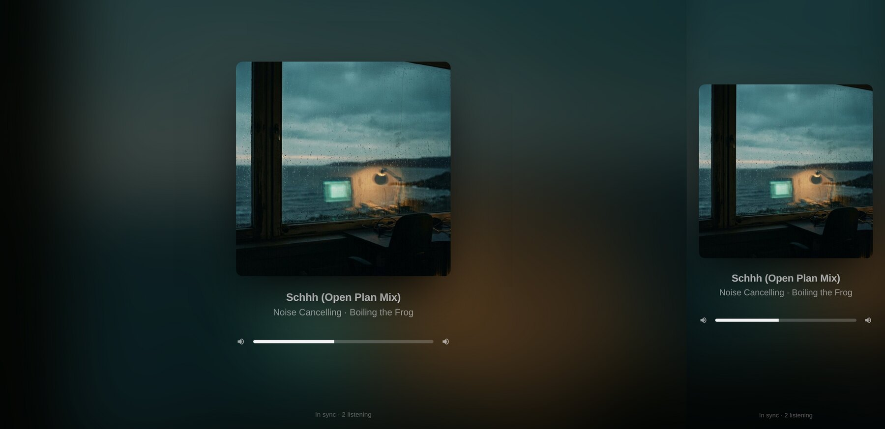

# 📻 BoomerBlaster


> BoomerBlaster is a silent disco for the open-plan office. You play music from
> your phone or your Mac; everyone who wants to listen opens a web page and
> hears it in their own headphones, in time with everyone else. The colleague
> who wants quiet hears nothing at all.

The landing page, in the register of a product launch:
**[den-frie-vilje.github.io/boomerblaster](https://den-frie-vilje.github.io/boomerblaster/)**.
This README is the manual.

## Check whether you need it

You need BoomerBlaster if all of the following are true:

- You share an open-plan office and a speaker would annoy someone.
- Everyone has headphones and a laptop or a phone with a browser.
- You want to play from the apps you already use: Music, Spotify, Tidal,
  anything that can AirPlay, or Spotify on any phone.
- You want the listeners in sync with each other, and you want the page to
  show what is playing, with cover art.

BoomerBlaster runs on one Mac, the DJ's. It needs nothing installed anywhere
else. The Mac must be on the same network as the listeners and, if it is a
laptop, it should stay open and awake for the length of the set.

## What you need

- A Mac with [Homebrew](https://brew.sh). If Terminal answers
  `command not found: brew`, install it first.
- A network where devices can reach each other. Office Wi-Fi sometimes
  isolates clients; if colleagues cannot open the page, that is the first
  thing to ask about. A cable into the DJ's Mac helps with twenty listeners.
- For Spotify Connect, a Spotify Premium account. librespot, the receiver
  BoomerBlaster uses, does not work with free accounts.

## Install BoomerBlaster

```sh
brew install den-frie-vilje/tap/boomerblaster
```

This also installs the three programs BoomerBlaster drives: `snapcast`,
`shairport-sync` and `librespot`.

Or from a clone of this repository, run `./install.sh`, which checks the
same dependencies and copies the command into `~/.local/bin`.

## Set up BoomerBlaster

1. Run:

   ```sh
   boomerblaster init
   ```

   BoomerBlaster checks that the three programs are present, installs the
   listener page, fetches your own control page (Snapweb, a pinned release
   whose checksum it verifies), and writes its configuration. It answers
   with something like:

   ```
   found snapserver at /opt/homebrew/bin/snapserver
   found shairport-sync at /opt/homebrew/bin/shairport-sync
   found librespot at /opt/homebrew/bin/librespot
   listener page installed from /opt/homebrew/share/boomerblaster/listener
   fetching the admin page (Snapweb 0.9.3)
   admin page unpacked in /Users/you/Library/Application Support/boomerblaster/www/admin
   config written to /Users/you/.config/boomerblaster/config.json
   snapserver.conf written to /Users/you/.config/boomerblaster/snapserver.conf
   ```

   To give the venue a name other than "BoomerBlaster", the name phones will see,
   run `boomerblaster init --name "Third floor"` instead.

2. Start it:

   ```sh
   boomerblaster start
   ```

   The server keeps running in the background, also after you log in again,
   until you run `boomerblaster stop`. If macOS asks whether `snapserver`,
   `shairport-sync` or `librespot` may accept incoming connections, allow it;
   that is listeners and phones reaching your Mac.

3. Get the address to send round:

   ```sh
   boomerblaster url
   ```

   It prints two: one with your Mac's name, such as `http://oles-mbp.local:1780`,
   and one with its IP address for devices that cannot resolve the name.

4. Check that everything is in place with `boomerblaster doctor`.

## Let colleagues in



Colleagues open the address in any browser, tap the artwork and put on their
headphones. The page shows the cover art large, the track and artist
underneath, and one slider with a mute button that moves their own ears only.
There is nothing else on it: play, pause and skip belong to your phone.
The lock screen and keyboard media keys show the track but do not control it.

Your own controls are at `/admin/` on the same address: Snapweb, Snapcast's
control panel, where you can see every listener, set the stream, and rename or
remove a client. Keep that address to yourself.

Laptops are the best listeners. Phones work too while the page is in the
foreground; iOS stops the audio when the screen locks.

## Play something

From an iPhone, iPad or Mac: open any app that can AirPlay, choose AirPlay
and pick the device named after your venue. Music, Spotify, Tidal, YouTube
and podcasts all qualify.

From any phone with Spotify: open Spotify, choose "connect to a device" and
pick the same name.

Both sources feed the same page. If both play at once, AirPlay wins and
Spotify waits.

## What to expect

- **Sync.** Listeners play each chunk of audio at a time agreed with the
  server, so laptops land within a few tens of milliseconds of each other.
  Nobody hears anyone else's headphones, so that is comfortably enough.
- **Delay.** From your thumb to their ears takes about two seconds. AirPlay
  buffers that much by design. Nobody is beat-matching across the office.
- **Cover art.** AirPlay from Music and most players sends title, artist,
  album and the artwork. Spotify Connect sends what librespot reports,
  title and artist at least.
- **Bandwidth.** With the default FLAC codec, each listener takes about
  700 kbit/s. Twenty listeners over Wi-Fi is comfortable; forty wants a cable.
- **Sleep.** While the server runs, the Mac is kept from idle sleep. Closing
  the lid still ends the set.

## Settings

BoomerBlaster writes and reads these files, and nothing else:

- `~/.config/boomerblaster/config.json`, the settings below
- `~/.config/boomerblaster/snapserver.conf`, generated from them
- `~/Library/Application Support/boomerblaster/www/`, the listener page, with
  the admin page under `admin/`; the server's own state sits beside it
- `~/Library/LaunchAgents/dk.denfrievilje.boomerblaster.plist`, while running
- `~/Library/Logs/boomerblaster.log`, the server log

`config.json` keys:

| Key | Default | Meaning |
| --- | --- | --- |
| `name` | `"BoomerBlaster"` | what phones see in the AirPlay and Spotify Connect lists |
| `http_port` | `1780` | the listener page's port |
| `stream_port`, `control_port` | `1704`, `1705` | Snapcast's audio and control ports |
| `codec` | `"flac"` | `pcm`, `flac` or `opus`; pcm is the most robust, opus the lightest |
| `buffer_ms` | `1000` | time between stamping a chunk and playing it; raise on poor Wi-Fi |
| `airplay` | `true` | offer an AirPlay receiver |
| `spotify` | `true` | offer a Spotify Connect receiver |
| `spotify_bitrate` | `320` | 96, 160 or 320 |

Change any of them from the command line, for example
`boomerblaster set codec opus` or `boomerblaster set spotify false`, then
`boomerblaster restart`.

## All commands

```
init            check programs, fetch the listener page, write config
start           run in the background until stop, also after login
stop            stop and remove the background job
restart         apply changed settings
run             run in the foreground (what start runs for you)
status          listeners, live source, current track (--json for scripts)
url             the address to send round (--admin for yours; --json for scripts)
doctor          check programs, files, ports, hostname and firewall
set KEY VALUE   change a setting
config          print settings and file locations
logs [-f]       show the server log
disarm          same as stop; run before brew uninstall
version         print the version
```

`boomerblaster status --json` returns Snapcast's full server state and exits 3
when the server is down, so a script can poll it. `boomerblaster doctor` exits 2
when something needs attention.

## Uninstall

```sh
boomerblaster stop
brew uninstall boomerblaster
```

Or `./uninstall.sh` from a clone. Both leave the configuration, the listener
page and the log in place; the paths above tell you what to delete for a
clean slate.

## How it works

BoomerBlaster is one Python file that configures and supervises three
open-source programs:

- [shairport-sync](https://github.com/mikebrady/shairport-sync) receives
  AirPlay and hands over audio and metadata.
- [librespot](https://github.com/librespot-org/librespot) receives Spotify
  Connect.
- [snapserver](https://github.com/snapcast/snapcast) takes both, stamps every
  20 ms of audio against one clock and streams it to listeners.
- The listener page in `listener/` plays the stream in sync and shows the
  track. Its audio engine and control client are Snapweb's own modules,
  copied in with their GPL-3 licence; the page itself adds the artwork, the
  volume and nothing else. It is built with Vite into `listener/dist`, which
  is committed and installed with the formula.
- [Snapweb](https://github.com/snapcast/snapweb), Snapcast's control panel,
  is served at `/admin/` for the DJ. `init` downloads a pinned release and
  verifies its checksum.

`boomerblaster init` writes a `snapserver.conf` with one stream per receiver and
a `meta` stream that wraps them, so listeners sit on a single stream named
after the venue and hear whichever source is playing. Both receivers deliver
44.1 kHz stereo, so nothing is resampled.

## Limits

- **Chromecast is not a source.** Commercial apps check that a Cast receiver
  holds a certificate issued by Google, and no open-source receiver can get
  one. Spotify Connect covers the usual reason for wanting it. If you need a
  Chromecast anyway, a physical one with audio out into a USB interface can
  be captured with a `process://` source; title and cover art are lost.
- **AirPlay 1, not 2.** Homebrew's shairport-sync is built for classic
  AirPlay. Phones and Macs cast to it without noticing; the difference is
  multi-room, which BoomerBlaster does not need.
- **Browsers vary.** Chrome, Edge and Firefox report their output latency
  precisely; Safari less so, and may sit a few tens of milliseconds off.

## Licence

MIT for the command, the installer and this documentation. The listener page in
`listener/` is GPL-3.0-or-later, because it builds on Snapweb's modules; its
licence file sits in that directory. The programs BoomerBlaster installs and
downloads carry their own licences: Snapcast and Snapweb GPL-3, shairport-sync
and librespot MIT.
